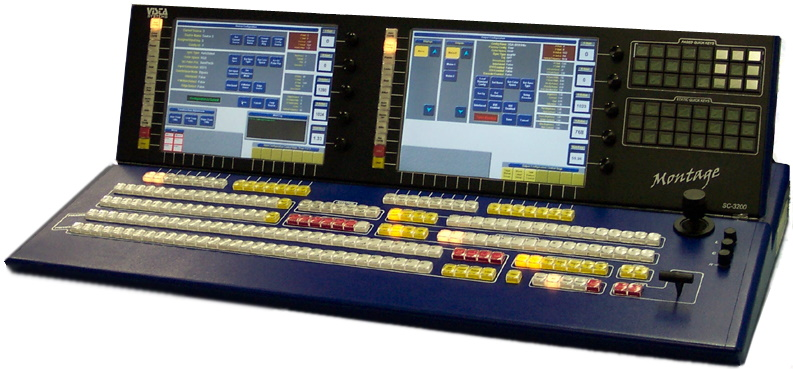
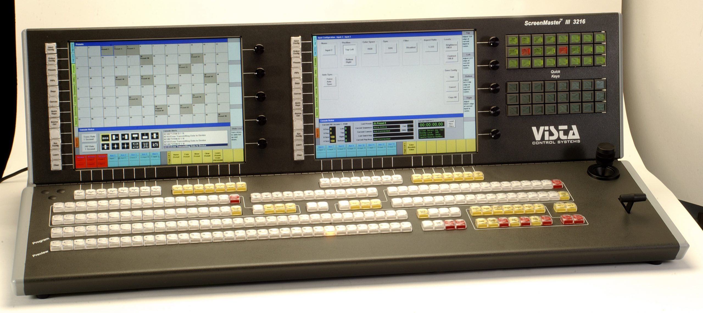

# Vista Console Hardware Library
Hardware interface to interact with Vista Systems ScreenMaster III 3216 and Montage SC-3200 controller hardware.  This is a console circa 2000 - 2005, and sold for around $50,000.  These days they are a rare find (check eBay), but if you can find one you can use the resources in this repo to upcycle this amazing device and re-purpose it for your modern-day controller needs.

To see what I'm doing with it, take a look at this first in a series of [blog posts here](https://www.knightware.net/?p=3989) for more info on my own projects.

## Consoles supported by this library

